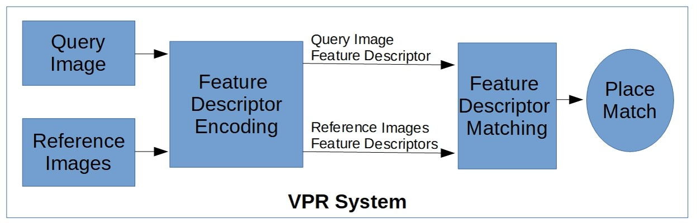
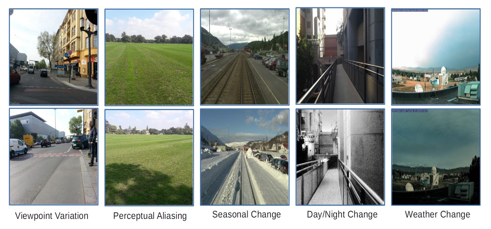

# Visual Place Recognition: A Hands-on Tutorial
## What to expect from this tutorial?
This tutorial is targeted at beginners starting their research in Visual Place Recognition (VPR). Through this tutorial you will get a quick overview of VPR, its challenges, research directions and the basic architecture. However, the primary objective of this tutorial is to enable young researchers to dive into coding by providing simple and effective code snippets and the necessary installation of dependencies to get going.

## What not to expect from this tutorial?
This is not an advanced tutorial. We do not teach you how to train a deep-learning network for VPR and neither do we discuss the details of various handcrafted and deep-learning architectures that can-be/have-been employed for VPR. However, the theoretical part of this thesis does provide important links/references, which you can access for further developing your understanding on these topics.

## Requirements and Installation Instructions
Because the primary objective of this tutorial is to get you going with basic VPR codes, it is required that you have a Linux-running PC, with a decent RAM size (>4GB). We presume that the reader of this tutorial is completely new to research environment and therefore we also help you setup a usual research PC. You do not require a GPU (Graphical Processing Unit) for running the codes in this tutorial.

As far as the dependencies are concerned, given that this tutorial provides basic codes for several VPR techniques, the dependencies are wide ranged because these techniques vary a lot. The original rights of these techniques lie with their corresponding authors and we thank them for open-sourcing these techniques.

There are 2 primary ways to install the dependencies for running this tutorial: importing the anaconda environment and the executable bash file. So let's start with getting your PC ready.

Basic PC Setup:
1. Please install a Linux-based operating system on your Desktop/Laptop. My recommendation is that you install a dual-boot operating system, if you (must) require another OS (e.g, Windows), instead of running Linux as virtual-machine on Windows etc. We need as much compute power as possible and running a VM may divide that between your OSs. This tutorial has been tested on a Ubuntu 18.04 LTS system (and we therefore suggest you the same). Here is a nice tutorial on installing a dual-boot Ubuntu 18.04 system: https://www.itzgeek.com/how-tos/linux/ubuntu-how-tos/how-to-install-ubuntu-18-04-alongside-with-windows-10-or-8-in-dual-boot.html

2. Once you have installed Ubuntu 18.04 LTS on your PC, please install Anaconda Python. Anaconda Python is an excellent distribution for developing, managing and sharing your Python projects. Not only does Anaconda provide an excellent support regarding Python Packages (Anaconda Cloud), it is also a good tool for creating different environments, e.g,  a different environment for your Python 2 compatible projects running a particular version of OpenCV, Caffe and such, and a different environment for another version of these packages given the respective requirements. Here is the version of Anaconda that I am using while writing this tutorial: https://repo.anaconda.com/archive/Anaconda2-5.3.0-Linux-x86_64.sh and below is a one-line installation instructions (Note: Change bash Path below based on your download directory/path):

```
bash ~/Downloads/Anaconda2-5.3.0-Linux-x86_64.sh
```

3. Once you have installed Anaconda on your Ubuntu OS, go to the environments folder in the tutorials code repository and find the file named 'tutorial_env.yml'. This is an Anaconda YAML file containing the environment with all dependencies installed for this tutorial. Import and activate this environment using the below commands in Linux terminal. After successful execution of this, the prompt in your current terminal will change with the environment name (e.g. myenv) pre-fixed. You should now be able to run all the Python codes in this tutorial.

```
conda env create -f tutorial_env.yml
conda activate myenv
```

4. If for some reason, the Step 3 (conda environment import) causes issues while dependency installation, I have also created a bash script, namely 'tutorial_dependencies.sh', which can be executed from the terminal to install dependencies. This Step 4 is only for the case when Step 3 doesn't work for you due to conda updates and such. From your Linux terminal, go to the directory of this tutorial (if not already there) and run the below 2 commands. Note that issues arise later on when you use different versions for any of the modules (caffe, opencv, numpy, python etc), therefore I would recommend that you install the exact versions as specified in this tutorial.

```
chmod +x tutorial_dependencies.sh
./tutorial_dependencies.sh
```

5. There is a minor change required in the Caffe library code, which otherwise leads to issue while running the tutorial later on. Please go to line 253-254 in caffe/python/caffe/io.py and replace

```
if ms != self.inputs[in_][1:]:
    raise ValueError('Mean shape incompatible with input shape.')
```
With
```
if ms != self.inputs[in_][1:]:
    print(self.inputs[in_])
    in_shape = self.inputs[in_][1:]
    m_min, m_max = mean.min(), mean.max()
    normal_mean = (mean - m_min) / (m_max - m_min)
    mean = resize_image(normal_mean.transpose((1,2,0)),in_shape[1:]).transpose((2,0,1)) * (m_max - m_min) + m_min
    #raise ValueError('Mean shape incompatible with input shape.')
```

5. GitHub does not allow hosting files larger than 100MB in a repository. However, the AlexNet and AMOSNet pre-trained Caffe models required in this tutorial are larger than 100MB. I have therefore uploaded these on Google Drive. Please download the AlexNet Caffe model from [https://drive.google.com/file/d/15cfTR39btZIoTzhW1Y-u3xeFWYON_YjG/](https://linkprotect.cudasvc.com/url?a=https%3a%2f%2fdrive.google.com%2ffile%2fd%2f15cfTR39btZIoTzhW1Y-u3xeFWYON_YjG%2f&c=E,1,Up5a1KOvFQiH6luErCqEpIBE-n2xkho2HrDeq1coZGOVgA0Hltp46-zrbk3m4vsbejlNy3VvIqqRDNbYeUtnDcxOAsee8rK1pKefag9Ewi6wkGlMHor2&typo=1)' and copy it into the folder 'VPR_Tutorial/VPR_Techniques/AlexNet_VPR/alexnet/. Also, download the AMOSNet Caffe model from [https://drive.google.com/file/d/10VcwzbvGbExG6Ja47Zp59DjvNBQql0Gm/](https://linkprotect.cudasvc.com/url?a=https%3a%2f%2fdrive.google.com%2ffile%2fd%2f10VcwzbvGbExG6Ja47Zp59DjvNBQql0Gm%2f&c=E,1,I-aREEqhm6e8Qk9775pKQLhC0T48kd1yTVjQt1ixUGlaKyuwukpO-4sQOkk-Re_V1UriPhUqEUQxJMnowQjQ_eC7VUiZqoj-yUVnRlh6n1qLrOcZz5I,&typo=1) and copy it into the folder 'VPR_Tutorial/VPR_Techniques/AmosNet/'.

# Visual Place Recognition-Theory

## Problem Statement
Visual Place Recognition (VPR) is the process of recognising a previously visited place using visual information, often under varying appearance conditions and viewpoint changes and with computational constraints. VPR is related to concepts of localisation, loop closure and is a critical component of many autonomous navigation systems ranging from autonomous vehicles to drones. While the concept of place recognition has been around for many years, visual place recognition research has grown rapidly as a field over the past decade due to both improving camera hardware technologies and its suitability for application of deep learning-based techniques.

A typical block-diagram of a VPR system looks something like the below:


## Challenges
The challenges within VPR can be divided into two main areas: matching performance and computational requirements. For matching 2 images, some of the primary challenges are different viewpoints, seasons, times-of-day and weather conditions. These are visually shown below. Another interesting challenge regarding appearance within VPR is perceptual-aliasing. Perceptual-aliasing refers to images of geographically different places that may appear visually similar. Such images are called perceptually-aliased because there is no distinct information available for a VPR system to distinguish between the two.


## Applications
The ability to correctly and efficiently recall previously seen places using only visual input has several important applications. A key application lies in loop-closure to correct error drifts in a SLAM (Simultaneous Localisation and Mapping) pipeline. However, the applications of VPR systems extend to several other domains that utilise computer vision modules, e.g., image search based on visual content, location refinement given human-machine interfaces, query-expansion, improved representations, vehicular navigation, asset-management using aerial imagery and 3D-model creation, to name a few. If you are interested to read further on the applications of VPR, the {survey paper}(https://ieeexplore.ieee.org/document/7339473) by Lowry et al. published in IEEE T-RO would be a key resource.

# Visual Place Recognition-Practicals
Based on the VPR block-diagram shared above, I have divided the tutorials into very basic and short code snippets that achieve each of the task in the block diagram. I presume that you have already setup an Anaconda environment (with all the dependencies specified in the provided YAML file or Shell Script) in a Ubuntu system, based on the requirements described above.

## Feature Descriptor Encoding
Feature descriptor encoding is the simple task of encoding an input image into a fixed-size descriptor which explains the salient information in the image, preferably in dimensions lower than the image itself. For VPR, this feature descriptor should also preferably be viewpoint and condition-invariant, however viewpoint-invariance may not be required depending upon the matching mechanism.

Please go into the 'feature_descriptor_encoding.py' file provided in this repository and look at the various encoding techniques used for VPR. Run this Python file from the terminal by typing the below in your terminal (make sure your terminal is in the directory of the tutorial, use 'cd' command to get there):

```
python feature_descriptor_encoding.py
```

You'll see the sizes and types of various feature descriptors for VPR that are a part of this tutorial. Play around with the code to get comfortable with these techniques.

## Feature Descriptor Matching
Once the feature descriptors have been computed for images, let's say two images, the next task is to match these two descriptors to assess how similar these images are and a corresponding score is yielded as output depicting this similarity. This score is usually in the range of 0-1, higher the score, higher the similarity. The different scores in between a pair of images for different VPR techniques does not mean that the technique with the score closest to 1 is the best performing technique. Performance is based on relative distinguishability between same and different place images, instead of absolute matching score. Such comparison of best performing technique is done in the next section of image retrieval.

Please go into the 'feature_descriptor_matching.py' file provided in this repository and look at the various matching techniques used for VPR. Run this Python file from the terminal by typing the below in your terminal (make sure your terminal is in the directory of the tutorial, use 'cd' command to get there):

```
python feature_descriptor_matching.py
```

You'll see the matching scores and types of various feature matching techniques for VPR that are a part of this tutorial. Play around with the code to get comfortable with these techniques.

## Image Retrieval

The original objective of a VPR system is to retrieve a prospective place matching candidate for a given query image from the given reference image map/dataset/database. For image retrieval, the feature descriptors for all reference images and the query image are computed. All of the reference images' feature descriptors are then matched with the query image feature descriptor and the image with the highest matching score is considered as the correct match.

Please go into the 'image_retrieval.py' file provided in this repository and look at the various place matching candidates retrieved by the techniques used for VPR. Run this Python file from the terminal by typing the below in your terminal (make sure your terminal is in the directory of the tutorial, use 'cd' command to get there):

```
python image_retrieval.py
```

You'll see the correct and incorrect images retrieved by various VPR techniques that are a part of this tutorial. The dataset used for this module is a subset of the Gardens Point dataset. You can easily add more images in the dataset repository and play around with the code to see the effects.

## Some VPR Datasets

I have uploaded a good number of VPR datasets in my GitHub repo [here](https://github.com/MubarizZaffar/VisualPlaceRecognitionDatasets). You can also access the open-source code for [CoHOG](https://github.com/MubarizZaffar/CoHOG_Results_RAL2019). A large number of VPR techniques are available in [VPR-Bench](https://github.com/MubarizZaffar/VPR-Bench) and [VGBench](https://github.com/gmberton/deep-visual-geo-localization-benchmark).

## Contact and Troubleshooting

If you are facing any problems with the practicals and/or if you have any questions about the theoretical element or any research-related questions, please send me an email at mubarizzaffar@gmail.com

## Acknowledgements
In the codes for this tutorial, I have used the VPR techniques CALC, AlexNet and AMOSNet. These have been open-sourced but please refer to the original authors and acknowledge their contributions if you use this in your work. I have copied the citations for these below. 

@article{merrill2018lightweight,
  title={Lightweight Unsupervised Deep Loop Closure},
  author={Merrill, Nate and Huang, Guoquan},
  journal={arXiv preprint arXiv:1805.07703, Robotics Science and Systems Conference},
  year={2018}
}

@inproceedings{chen2017deep,
  title={Deep learning features at scale for visual place recognition},
  author={Chen, Zetao and others},
  booktitle={ICRA},
  pages={3223--3230},
  year={2017},
  organization={IEEE}
}

This tutorial was developed as part of my affiliation with the Embedded and Intelligent Systems lab at University of Essex, which has been funded by UK-EPSRC and UKRI.   
